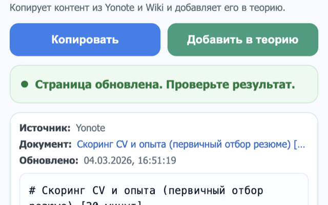

# Practicum Theory to New Editor

Расширение для переноса контента из `Yonote` и `Wiki` в новый редактор теории Praktikum. Оно помогает забрать материал со страницы-источника, сохранить структуру и доступные изображения, а затем вставить результат в теорию.



## Что делает расширение

- копирует контент со страниц `yonote.ru` и `wiki.yandex-team.ru`
- подготавливает текст для вставки в редактор теории Praktikum
- переносит доступные изображения и связанные ассеты
- помогает вставить результат на страницах `admin.praktikum.yandex-team.ru` и `admin-prestable.practicum.yandex-team.ru`

С версии `3.5.4` поддерживается новый адрес prestable: https://admin-prestable.practicum.yandex-team.ru/. Старый адрес `prestable.admin.praktikum.yandex-team.ru` также поддерживается.

## Как установить локально через dev-режим

Для установки в браузер нужна не сама `.zip`, а распакованная папка расширения.

1. Скачайте ZIP-архив с расширением.
2. Если архив скачан из GitHub, можно использовать кнопку `Code` -> `Download ZIP`.
3. Распакуйте архив в отдельную папку на компьютере.
4. Убедитесь, что внутри выбранной папки лежит файл `manifest.json`.
5. Именно эту распакованную папку нужно выбирать в браузере через `Load unpacked` / `Загрузить распакованное расширение`.

## Установка в Google Chrome

1. Скачайте ZIP-архив и распакуйте его в отдельную папку.
2. Откройте в Chrome страницу `chrome://extensions`.
3. Включите переключатель `Developer mode` / `Режим разработчика` в правом верхнем углу.
4. Нажмите `Load unpacked` / `Загрузить распакованное расширение`.
5. Выберите распакованную папку, в которой лежит `manifest.json`.
6. Убедитесь, что расширение `Practicum Theory to New Editor` появилось в списке и включено.
7. При необходимости закрепите иконку расширения через меню расширений в панели браузера.

После установки откройте страницу в `Yonote`, `Wiki` или в админке теории Praktikum и используйте расширение через иконку в браузере.

## Установка в Яндекс Браузер

1. Скачайте ZIP-архив и распакуйте его в отдельную папку.
2. Откройте страницу `browser://extensions`.
3. Если `browser://extensions` не открывается, попробуйте `chrome://extensions`.
4. Включите `Режим разработчика`.
5. Нажмите `Загрузить распакованное расширение`.
6. Выберите распакованную папку, в которой лежит `manifest.json`.
7. Проверьте, что расширение появилось в списке и включено.

После установки откройте нужную страницу и используйте расширение через иконку в панели браузера.

Примечание для Яндекс Браузера: локально установленные расширения не из магазина могут помечаться как установленные из непроверенного источника. До публикации стабильной версии может потребоваться повторно включать такое расширение вручную.

## Как удалить локальную версию после публикации в магазине

1. Откройте страницу расширений: `chrome://extensions` в Chrome или `browser://extensions` в Яндекс Браузере.
2. Найдите `Practicum Theory to New Editor`.
3. Нажмите `Remove` / `Удалить`.
4. После этого установите стабильную версию из магазина расширений.

Ссылка на стабильную версию будет добавлена сюда после публикации:

`[ссылка появится после публикации]`

## Локальная проверка

```bash
npm test
```
